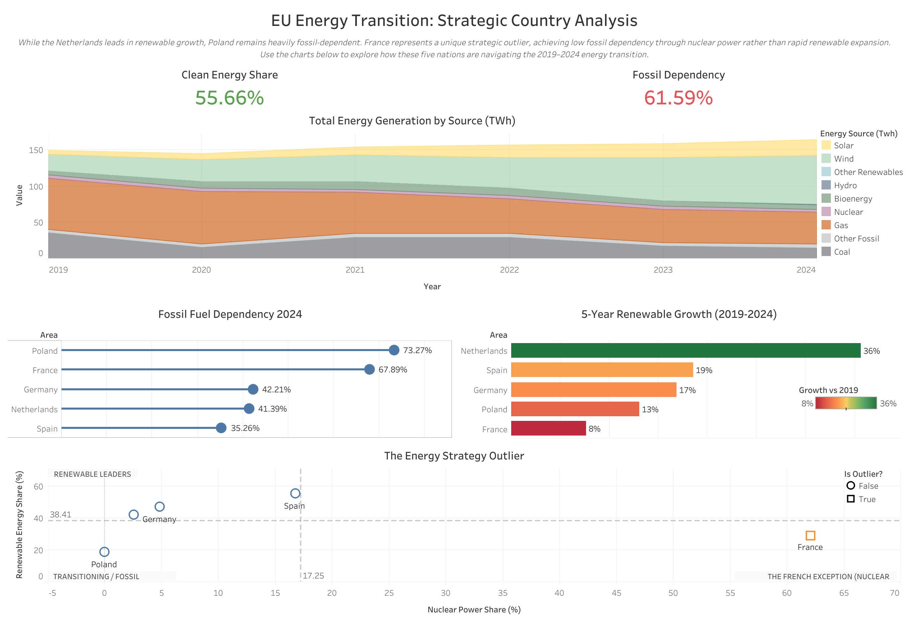

# EU Energy Transition: Strategic Country Analysis (2019-2024)

---

## 📊 Live Interactive Dashboard
**[👉 Click Here to View My Dashboard on Tableau Public](https://public.tableau.com/views/TheEuropeanEnergyTransitionA5-CountryStrategicAnalysis2019-2024/EUEnergyTransitionStrategicCountryAnalysis?:language=en-US&:sid=&:redirect=auth&:display_count=n&:origin=viz_share_link)**

---

## 🎯 Project Overview
This project provides a comparative analysis of the energy transition paths of five major EU energy producers: **France, Germany, Netherlands, Poland, and Spain**. Using data from 2019 to 2024, the study explores how different national strategies—ranging from nuclear-heavy to rapid renewable expansion—impact fossil fuel dependency.

### 💡 Key Insights:
* **The French Exception:** While most nations rely on renewable growth to lower fossil dependency, France maintains one of the lowest fossil rates in the EU (~10%) due to its massive nuclear power baseline (~60-65% share).
* **Rapid Transition:** The Netherlands showed the highest renewable growth rate in the 5-year period, significantly outpacing its peers in percentage-point increases.
* **The Coal Challenge:** Poland remains the regional outlier for fossil dependency, though the data shows a steady downward trend as renewable capacity comes online.

---

## 🛠️ Tech Stack & Workflow
* **Data Cleaning:** Python (Pandas) used to normalize energy metrics and handle year-over-year growth calculations.
* **Visualization:** Tableau (Interactive Dashboards, Lollipop Charts, Quadrant Analysis, Area Charts).
* **Interactivity:** Implemented Dashboard Actions for cross-chart highlighting and country-specific deep dives.

---
## 📈 Dashboard Features
* **Clean Energy Share KPI:** High-level summary showing the average percentage of non-fossil generation across the selected timeframe.
* **Fossil Fuel Dependency KPI:** A real-time tracker of the "Reliance Gap" that needs to be closed for a full green transition.
* **Total Energy Generation by Source:** A wide-lens view of the total energy mix (TWh), showing the scaling of different fuel types from 2019 to 2024.
* **Fossil Fuel Dependency 2024:** A current-state comparison of the five nations, highlighting Poland and France as the two extreme ends of the spectrum.
* **5-Year Renewable Growth:** A momentum indicator showing the percentage-point increase in renewables, identifying the Netherlands as the fastest mover.
* **The Energy Strategy Outlier:** A deep-dive chart mapping Nuclear Power Share vs. Renewable Share to visualize different national decarbonization models (e.g., the "French Exception").
